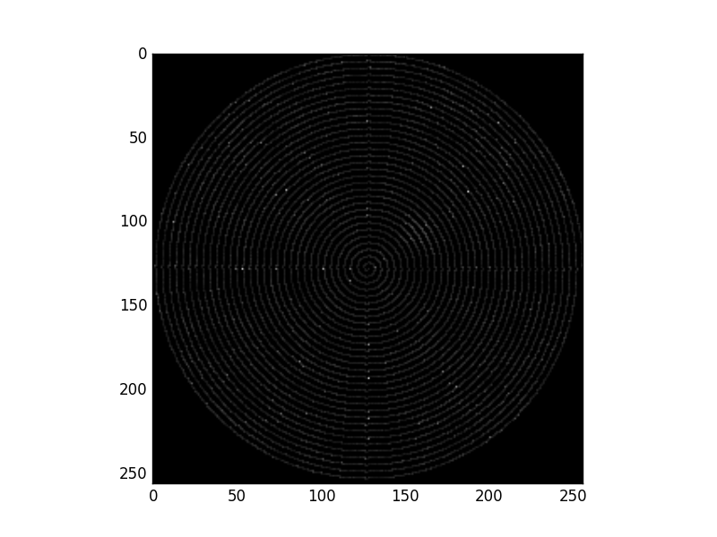

# RTSSTEM

This is the sourcecode for the paper [Compressive sensing on diverse STEM scans: real-time feedback, low-dose and dynamic range](https://arxiv.org/abs/1805.04957)



## Install

Simply
```
make
```

## Usage

Full Parameters:

-sparse_img: Input file of the sparse scanned image

-sparse_mk: Input file of sparse scanning mask

-wavelet: Specify wavelet type, example: db2

-output: Output file of reconstructed image

-Nr: Numer of rows of image

-Nc: Numer of columns of image

-nlevels: level of wavelet, usually 2,3,4

-iter: iterations, default is 10

-lambda: soft-thersholding value, default is 0.8

For example:
```
./RTSSTEM -sparse_img Lissa_yspar.dat -sparse_mk Lissa_mask.dat -wavelet db2 -output Lissa_yrecon.txt -Nr 256 -Nc 256 -nlevels 4
```
## Tested Environment

Ubuntu 16.04 LTS

CUDA 8 with driver version: 375.26

## Acknowledgements

The wavelet transform is based on fantastic [PDWT](https://github.com/pierrepaleo/PDWT) package, written by [Pierre Paleo](http://www.pierrepaleo.com/)
